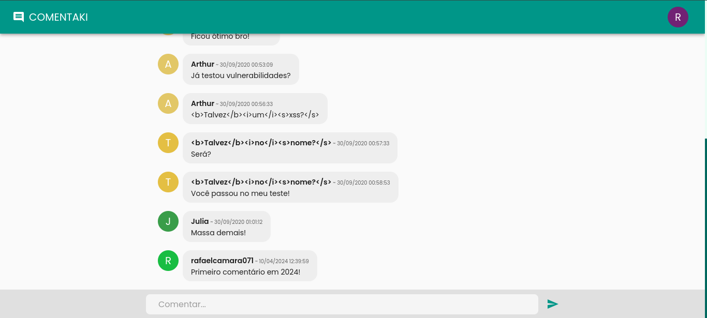
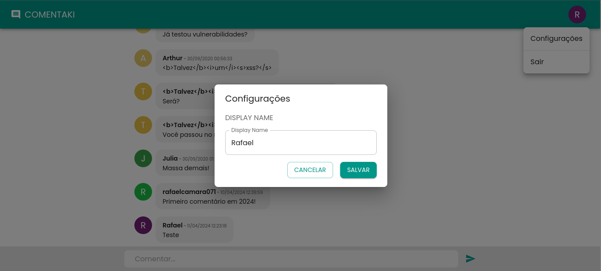

  
  

<h1 align="center">💬 Comentaki</h1>

  "Comentaki é um chat de comentários online em tempo real", integrado com o Firebase, uma poderosa plataforma de desenvolvimento de aplicativos da Google, Comentaki oferece uma experiência de comentários simples e interativa entre os usuários.

## Table of Contents

- [Table of Contents](#table-of-contents)
  - [Built With](#built-with)
- [Features](#features)
- [Screenshots](#screenshots)
- [Roadmap](#roadmap)
- [License](#license)
- [Contact](#contact)

### Built With

- [React](https://reactjs.org/)
- [TypeScript](https://www.typescriptlang.org/)
- [Material UI](https://mui.com/)
- [Emotion](https://emotion.sh/docs/introduction)
- [Firebase](https://firebase.google.com/)
- [Sonner](https://sonner.emilkowal.ski/)
- [React Hook Form](https://www.react-hook-form.com)
- [React Router](https://reactrouter.com/en/main)
- [Zod](https://zod.dev/)

## Features

- Criar Comentários
- Listagem de todos os comentários.
- Alterar displayName do usuário.

## Screenshots

  
  

## Roadmap

Recursos planejados para futuras versões:

- Adição de configuração de perfil de usuário com imagem.
- Implementação de autenticação com github.

## License

Este projeto está licenciado sob a Licença MIT - veja o arquivo [LICENSE](LICENSE) para mais detalhes.

## Contact

- E-mail: [rafaelcamara.377@gmail.com](mailto:rafaelcamara.377@gmail.com)
- LinkedIn: [Rafael Câmara](https://www.linkedin.com/in/rafael-camara-573a9313b/)

---
Feito com ♥️ por [Rafael Câmara](https://github.com/rafael-camara)
